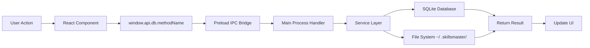

# SkillsMaster

<div align="center">


**Universal AI Agent Skill Management & Orchestration Platform**

*Create once. Deploy everywhere. Master every AI coding agent.*

[](https://www.electronjs.org/)
[](https://react.dev/)
[](https://www.typescriptlang.org/)
[](https://tailwindcss.com/)
[](https://vitejs.dev/)
[](https://www.sqlite.org/)

</div>

---

## 📖 Table of Contents

- [Overview](#-overview)
- [The Problem](#-the-problem)
- [The Solution](#-the-solution)
- [Key Features](#-key-features)
- [Tech Stack](#-tech-stack)
- [Architecture](#-architecture)
- [Supported AI Agents](#-supported-ai-agents)
- [Installation](#-installation)
- [Quick Start Guide](#-quick-start-guide)
- [Usage](#-usage)
- [Deployment Guide](#-deployment-guide)
- [Skills System](#-skills-system)
- [Why SkillsMaster is Cutting-Edge](#-why-skillsmaster-is-cuttingedge)
- [Roadmap & Future Plans](#-roadmap--future-plans)
- [Project Structure](#-project-structure)
- [Configuration](#-configuration)
- [Contributing](#-contributing)
- [License](#-license)

---

## 🎯 Overview

**SkillsMaster** is a sophisticated Electron-based desktop application that revolutionizes how developers manage, generate, and deploy AI coding agent skills across multiple AI agent platforms. It serves as a **centralized skill orchestration system** that bridges the gap between various AI coding assistants and reusable, portable skill blueprints.

### Vision

Empower developers to build a **universal skill library** that works seamlessly across all major AI coding agents, eliminating vendor lock-in and maximizing the potential of AI-assisted development.

---

## ❗ The Problem

The AI coding assistant ecosystem is **fragmented and inefficient**:

- 🔀 **Multiple Formats**: Each AI agent (Claude Code, Cursor, Copilot, Gemini) uses different skill/prompt formats and storage locations
- 🔁 **Redundant Work**: Skills created for one agent can't be easily transferred to another
- 📦 **No Centralization**: Managing skills across projects and agents requires manual file operations
- 🎨 **No Standardization**: Skill quality varies wildly without templates or best practices
- 🚫 **No Discovery**: Hard to browse, search, or share skills across teams
- 🔐 **API Key Chaos**: Managing multiple AI provider keys across different tools

---

## ✨ The Solution

SkillsMaster provides a **unified skill management platform**:

- ✅ **Write Once, Deploy Everywhere**: Create a skill once and sync it to Claude, Cursor, Copilot, Gemini, and more
- ✅ **AI-Powered Generation**: Generate professional `SKILL.md` files using 12+ AI providers with architectural awareness
- ✅ **Centralized Library**: Single source of truth for all AI agent capabilities across all projects
- ✅ **Smart Project Detection**: Automatically detects project context and tech stack
- ✅ **Standardized Format**: Enforces consistent skill structure with YAML frontmatter and markdown
- ✅ **Backup & Sharing**: Export/import skill packs as `.skillsmaster` files for team collaboration

---

## 🚀 Key Features

### Core Capabilities

| Feature | Status | Description |
|---------|:------:|-------------|
| **Skill Library Management** | ✅ | Browse, filter, search skills by category with grid view |
| **AI Skill Generation** | ✅ | Generate `SKILL.md` files using 12+ AI providers |
| **Skill Idea Generation** | ✅ | AI scans project architecture and suggests relevant skills |
| **Skill Refactoring** | ✅ | Preview and commit AI-powered skill updates |
| **Multi-Agent Sync** | ✅ | Deploy skills to 7+ AI agents simultaneously |
| **Project Management** | ✅ | Track multiple projects with local skills detection |
| **Skill Pack Export/Import** | ✅ | ZIP-based backup and sharing (`.skillsmaster` format) |
| **External Skill Import** | ✅ | Import from folders or other agent directories |
| **Windows Context Menu** | ✅ | Right-click "Open with SkillsMaster" on folders |
| **API Key Rotation** | ✅ | Multiple keys per provider with automatic failover |
| **Active Project Detection** | ✅ | Auto-detect project launched from context menu |
| **Stack Detection** | ✅ | Auto-detect Node.js, React, Python, Rust, Go, and more |

### Dashboard

<div align="center">
<i>Real-time project context and skill deployment overview</i>
</div>

- 📊 **Active Project Context**: Displays current project path and metadata
- 🛠️ **Tech Stack Visualization**: Auto-detected technologies with icons
- 📋 **Local Agent Skills**: Lists skills attached to current project
- 📜 **Recent Sync History**: Track recent skill deployments

### Skills Library

- 🔍 **Advanced Filtering**: Filter by Basic, Advanced, or Tool Skill categories
- 🔎 **Full-Text Search**: Search across skill names, descriptions, and content
- 📥 **Bulk Import**: Import skills from folders or existing agent directories
- 🚀 **One-Click Deploy**: Sync skills to connected AI agents instantly

### Generate Skill

- 🧠 **Rich Contextual Form**:
  - Project Type (Web App, CLI, API, Mobile, Library, etc.)
  - Target Agent (Claude, Cursor, Copilot, Gemini, etc.)
  - Complexity Level, Output Style, Tone
  - Language, Framework, Tools specification
- 📝 **Category-Specific Prompts**:
  - **Workflow Skills**: Process and methodology blueprints
  - **Tool Skills**: Technical implementation guides
  - **Prompt Skills**: Communication and interaction patterns
- 🎯 **YAML Frontmatter**: Auto-generated metadata for skill portability

### Generate Ideas

- 🔬 **Deep Project Scanner**: 3-level directory tree analysis
- 📄 **Config File Analysis**: Parses `package.json`, `requirements.txt`, `Cargo.toml`, etc.
- ⚠️ **Error Log Detection**: Identifies pain points from logs
- 💡 **AI-Architected Suggestions**: Returns 4 contextual skill ideas

### Agents Management

- 🔌 **7 Pre-Configured Integrations**:
  - **Global Agents**: Claude Code, Gemini CLI, Codex CLI, Antigravity IDE
  - **Local Agents**: Cursor, GitHub Copilot, Windsurf
- 🔗 **Connect/Disconnect**: Easy path resolution and validation
- 💾 **Persistent Storage**: Connection settings saved across sessions

### Projects Workspace

- 📁 **Multi-Project Support**: Manage multiple codebases simultaneously
- 🏷️ **Local Skill Detection**: Automatically finds `.agent/skills/` directories
- 🔄 **Quick Switch**: Instant context switching between projects
- ❌ **Workspace Management**: Add/remove projects effortlessly

### Settings

- 🖥️ **System Integration**: Windows context menu install/uninstall
- 🌐 **AI Provider Selection**: Choose default provider for skill generation
- 🤖 **Model Configuration**: Preset models + custom model input
- 🔑 **API Key Management**: Secure storage with rotation support

---

## 💻 Tech Stack

### Core Technologies

| Category | Technology | Version | Purpose |
|----------|------------|---------|---------|
| **Runtime** | Electron | 39.2.6 | Cross-platform desktop app |
| **Frontend** | React | 19.2.1 | UI component framework |
| **Language** | TypeScript | 5.9.3 | Type-safe development |
| **Build Tool** | Vite | 7.2.6 | Fast bundler and dev server |
| **Electron Build** | electron-vite | 5.0.0 | Electron-specific build system |
| **Styling** | Tailwind CSS | 4.2.1 | Utility-first CSS framework |
| **Database** | better-sqlite3 | 12.6.2 | High-performance SQLite |
| **Packaging** | electron-builder | 26.0.12 | Multi-platform installer creator |

### Supporting Libraries

- **@electron-toolkit/preload** & **@electron-toolkit/utils** - Electron utilities
- **@electron-toolkit/tsconfig** - TypeScript configurations
- **adm-zip** - ZIP file handling for skill packs
- **@vitejs/plugin-react** - React support in Vite
- **eslint** + **prettier** - Code quality and formatting
- **postcss** - CSS transformation

### AI Providers Supported (12+)

| Provider | Models | Integration Type |
|----------|--------|------------------|
| **OpenAI** | GPT-4, GPT-4o, o1, o3 | OpenAI-compatible API |
| **Anthropic** | Claude 3.5/3.7 Sonnet, Opus | OpenAI-compatible API |
| **Google** | Gemini 2.0/2.5 Pro, Flash | Direct REST API |
| **xAI** | Grok-2, Grok-3 | OpenAI-compatible API |
| **Alibaba** | Qwen 2.5/Max | OpenAI-compatible API |
| **Ollama** | Local models | OpenAI-compatible API |
| **OpenRouter** | Multi-provider gateway | OpenAI-compatible API |
| **Groq** | Llama, Mixtral (fast inference) | OpenAI-compatible API |
| **DeepSeek** | DeepSeek-V3, Chat | OpenAI-compatible API |
| **Moonshot** | Moonshot models | OpenAI-compatible API |
| **Together AI** | Open-source models | OpenAI-compatible API |
| **NVIDIA** | NVIDIA NIM models | OpenAI-compatible API |

---

## 🏗️ Architecture

### Three-Process Electron Architecture

```
┌─────────────────────────────────────────────────────────────────┐
│                        MAIN PROCESS                              │
│  (src/main/index.ts)                                            │
│  • Window lifecycle management                                  │
│  • IPC handler coordination                                     │
│  • Database initialization                                      │
│  • System tray & context menu                                   │
│                                                                  │
│  ┌────────────────────────────────────────────────────────┐    │
│  │              SERVICE LAYER (src/main/services/)         │    │
│  │  ┌──────────┐ ┌──────────┐ ┌──────────┐ ┌──────────┐  │    │
│  │  │database  │ │ library  │ │    ai    │ │attachment│  │    │
│  │  │   .ts    │ │   .ts    │ │   .ts    │ │   .ts    │  │    │
│  │  └──────────┘ └──────────┘ └──────────┘ └──────────┘  │    │
│  │  ┌──────────┐ ┌──────────┐ ┌──────────┐ ┌──────────┐  │    │
│  │  │ registry │ │ settings │ │ skillpack│ │  import  │  │    │
│  │  │   .ts    │ │   .ts    │ │   .ts    │ │   .ts    │  │    │
│  │  └──────────┘ └──────────┘ └──────────┘ └──────────┘  │    │
│  └────────────────────────────────────────────────────────┘    │
└─────────────────────────────────────────────────────────────────┘
                              ↕ IPC (Inter-Process Communication)
┌─────────────────────────────────────────────────────────────────┐
│                      PRELOAD PROCESS                             │
│  (src/preload/index.ts)                                         │
│  • Context Bridge (secure IPC isolation)                        │
│  • Exposes window.api.db.* methods to renderer                  │
│  • Exposes window.electron API                                  │
│  • Security: contextIsolation enabled                           │
└─────────────────────────────────────────────────────────────────┘
                              ↕ IPC
┌─────────────────────────────────────────────────────────────────┐
│                     RENDERER PROCESS                             │
│  (src/renderer/src/)                                            │
│  ┌──────────────────────────────────────────────────────────┐  │
│  │  React Components                                        │  │
│  │  ┌────────────┐ ┌────────────┐ ┌────────────────────┐   │  │
│  │  │   Views/   │ │ components/│ │    App.tsx         │   │  │
│  │  │  Dashboard │ │  layout/   │ │  (7 view routes)   │   │  │
│  │  │  Library   │ │ Navigation │ │                    │   │  │
│  │  │  Generate  │ │  Layout    │ │                    │   │  │
│  │  └────────────┘ └────────────┘ └────────────────────┘   │  │
│  └──────────────────────────────────────────────────────────┘  │
│  Styling: Tailwind CSS (dark theme, neutral-950 base)          │
└─────────────────────────────────────────────────────────────────┘
```

### Data Flow



### File System Structure

```
~/.skillsmaster/
├── skills/                 # Global skill library
│   └── {namespace}.{skill-name}/
│       └── v{version}/
│           ├── metadata.json    # Skill metadata
│           ├── SKILL.md         # Main blueprint
│           └── examples.md      # Optional examples
└── skillsmaster.sqlite     # Application database
```

### Database Schema

```sql
-- Skills table
skills (
  id TEXT PRIMARY KEY,           -- e.g., "my.react-optimizer"
  name TEXT,                     -- e.g., "react-optimizer"
  namespace TEXT,                -- e.g., "my" (author)
  category TEXT,                 -- Basic/Advanced/Tool
  description TEXT,
  created_at DATETIME
)

-- Version control
versions (
  skill_id TEXT,
  version TEXT,                  -- e.g., "v1.0", "v1.1"
  created_at DATETIME,
  PRIMARY KEY (skill_id, version)
)

-- Deployment tracking
installations (
  id INTEGER PRIMARY KEY,
  skill_id TEXT,
  version TEXT,
  path TEXT,                     -- Target deployment path
  created_at DATETIME
)

-- Application settings
settings (
  key TEXT PRIMARY KEY,          -- e.g., "globalProvider", "apiKeys_OpenAI"
  value TEXT                     -- JSON or string value
)
```

---

## 🤖 Supported AI Agents

SkillsMaster integrates with **7+ AI coding agents** out of the box:

### Global Agents (System-Wide)

| Agent | Default Path | Skill Directory |
|-------|--------------|-----------------|
| **Claude Code** | `~/.claude/` | `~/.claude/skills/` |
| **Gemini CLI** | `~/.gemini/` | `~/.gemini/skills/` |
| **Codex CLI** | `~/.codex/` | `~/.codex/skills/` |
| **Antigravity IDE** | `~/.antigravity/` | `~/.antigravity/skills/` |

### Local Agents (Project-Specific)

| Agent | Skill Directory | Notes |
|-------|-----------------|-------|
| **Cursor** | `.cursor/skills/` | Project-local |
| **GitHub Copilot** | `.github/copilot/` | Project-local |
| **Windsurf** | `.windsurf/skills/` | Project-local |

### Agent-Agnostic Skills

All skills generated by SkillsMaster use a **universal format** that can be deployed to any agent, regardless of the original target. The `SKILL.md` blueprint includes:

- YAML frontmatter with metadata
- Structured markdown content
- Agent-agnostic instructions
- Optional MCP server requirements

---

## 📦 Installation

### Prerequisites

- **Node.js**: Version 18 or higher (latest LTS recommended)
- **npm** or **yarn**: Package manager
- **Git**: For cloning the repository

### Development Setup

```bash
# Clone the repository
git clone https://github.com/yourusername/skillsmaster.git
cd skillsmaster

# Install dependencies
npm install

# Start development server with hot-reload
npm run dev

# Run type checking
npm run typecheck

# Lint code
npm run lint
```

### Production Build

```bash
# Build for current platform
npm run build

# Build for specific platforms
npm run build:win    # Windows (NSIS installer)
npm run build:mac    # macOS (DMG)
npm run build:linux  # Linux (AppImage, Snap, DEB)
```

### Built Application Location

After building, installers are located in:
- **Windows**: `dist/*.exe`
- **macOS**: `dist/*.dmg`
- **Linux**: `dist/*.AppImage`, `dist/*.snap`, `dist/*.deb`

---

## 🚀 Quick Start Guide

### Step 1: Initial Configuration

1. **Launch SkillsMaster**
2. Navigate to **Settings** (gear icon in sidebar)
3. Select your preferred **AI Provider** (OpenAI, Anthropic, Google, etc.)
4. Enter your **API Key(s)** - supports multiple keys for rotation
5. Choose a **Model** from the dropdown or enter a custom model name

### Step 2: Connect AI Agents

1. Navigate to **Agents** (plug icon in sidebar)
2. Click **Connect** on agents you use
3. Verify/adjust the detected paths
4. SkillsMaster will now be able to deploy skills to these agents

### Step 3: Add Your Projects

1. Navigate to **Projects** (folder icon in sidebar)
2. Click **Add Project** or use context menu integration
3. Select your project directory
4. SkillsMaster auto-detects local agent skills

### Step 4: Generate Your First Skill

1. Navigate to **Generate Skill** (sparkles icon)
2. Fill in skill details:
   - Name, namespace, category
   - Target agent and project type
   - Skill description and requirements
3. Click **Generate with AI**
4. Review and save the generated `SKILL.md`

### Step 5: Deploy Skills

1. Navigate to **Skills Library** (book icon)
2. Find your skill in the grid
3. Click **Deploy Sync** to attach to a project
4. Select target agent and project
5. ✅ Skill is now active in your AI agent!

---

## 📖 Usage

### Generating Skills with AI

SkillsMaster leverages multiple AI providers to generate high-quality, contextual skills:

#### Manual Skill Generation

1. **Fill Contextual Form**:
   - **Skill Name**: `react-performance-optimizer`
   - **Namespace**: Your identifier (e.g., `my`, `team-name`)
   - **Category**: Basic/Advanced/Tool Skill
   - **Project Type**: Web App, CLI, API, Mobile, Library, etc.
   - **Target Agent**: Claude, Cursor, Copilot, etc.
   - **Complexity**: Junior/Mid/Senior/Expert level
   - **Output Style**: Concise, Detailed, Tutorial, Reference
   - **Tone**: Formal, Casual, Encouraging, Direct
   - **Tech Stack**: Languages, frameworks, tools

2. **AI Generation**:
   - System constructs provider-specific prompt
   - Includes category-specific system instructions
   - Calls AI provider with context
   - Parses and cleans response
   - Ensures YAML frontmatter
   - Saves to skill library

3. **Review & Refine**:
   - Preview generated skill
   - Make manual edits if needed
   - Commit to library

#### AI-Powered Idea Generation

Let AI analyze your project and suggest skills:

1. **Select Project**: Choose from workspace or browse
2. **Provide Context** (optional):
   - Goals or pain points
   - Specific areas to focus on
3. **AI Analysis**:
   - Scans 3-level directory structure
   - Parses config files (`package.json`, `pyproject.toml`, etc.)
   - Detects tech stack and architecture patterns
   - Identifies error logs and issues
4. **Receive Suggestions**: Get 4 AI-architected skill ideas tailored to your project

### Skill Deployment Strategies

#### Single Agent Deployment

Deploy a skill to one specific agent:
- Click **Deploy Sync** on skill card
- Select target agent
- Choose project (if local agent)
- Confirm deployment

#### Multi-Agent Sync

Deploy the same skill to multiple agents simultaneously:
- Use **Bulk Deploy** feature (coming soon)
- Select multiple agents
- Deploy to all with one click

#### Version Management

SkillsMaster tracks skill versions:
- Each skill can have multiple versions (`v1.0`, `v1.1`, `v2.0`)
- View version history in skill details
- Rollback to previous versions (planned feature)

### Skill Pack Management

#### Export Skills

Backup or share your skill library:

1. Go to **Skills Library**
2. Click **Import External** → **Export**
3. Select skills to include
4. Downloads `.skillsmaster` ZIP file

#### Import Skills

Import skills from external sources:

**From ZIP Pack**:
1. Click **Import External** → **Import Pack**
2. Select `.skillsmaster` file
3. Skills added to library

**From Folder**:
1. Click **Import External** → **Import Folder**
2. Select directory with skill folders
3. Skills scanned and imported

**From Agent Directory**:
1. Click **Import External** → **Import from Agent**
2. Select agent (Claude, Cursor, etc.)
3. All agent skills imported to library

### Context Menu Integration (Windows)

Quick-open projects directly from File Explorer:

#### Install Context Menu

1. Go to **Settings**
2. Click **Install Context Menu**
3. Right-click any folder → **Open with SkillsMaster**
4. Folder automatically added to workspace

#### Uninstall Context Menu

1. Go to **Settings**
2. Click **Uninstall Context Menu**

---

## 🚀 Deployment Guide

### Deploying SkillsMaster Application

#### For Development

```bash
# Run in development mode
npm run dev
```

This launches the app with hot-module-replacement (HMR) for rapid development.

#### For Production Distribution

**Windows**:
```bash
npm run build:win
# Output: dist/SkillsMaster Setup X.X.X.exe
```

**macOS**:
```bash
npm run build:mac
# Output: dist/SkillsMaster-X.X.X.dmg
```

**Linux**:
```bash
npm run build:linux
# Output: dist/SkillsMaster-X.X.X.AppImage, .deb, .snap
```

### Deploying Skills to AI Agents

#### Manual Deployment

1. **Locate Skill**: Find skill in Skills Library
2. **Click Deploy Sync**: Opens deployment modal
3. **Select Target**:
   - Agent (Claude, Cursor, Copilot, etc.)
   - Project (for local agents)
4. **Confirm**: Skill copied to agent's skill directory

#### Automated Deployment (CI/CD)

For team environments, automate skill deployment:

```yaml
# Example GitHub Actions workflow
name: Deploy Skills

on:
  push:
    paths:
      - 'skills/**'

jobs:
  deploy-skills:
    runs-on: ubuntu-latest
    steps:
      - uses: actions/checkout@v4
      
      - name: Install SkillsMaster CLI (future)
        run: npm install -g skillsmaster-cli
      
      - name: Deploy to Claude Code
        run: skillsmaster deploy --agent claude --skills ./skills
```

*Note: CLI tool is planned for future release*

### Enterprise Deployment

For organizations:

1. **Central Skill Repository**: Host skills in a Git repository
2. **SkillsMaster Configuration**: Point all team members to central repo
3. **Automated Sync**: Use hooks or scheduled tasks to keep skills updated
4. **Access Control**: Manage skill permissions via namespaces

---

## 🎓 Skills System

### Skill Anatomy

Every skill in SkillsMaster follows a standardized structure:

```
skill-name/
├── metadata.json
├── SKILL.md
└── examples.md (optional)
```

#### metadata.json

```json
{
  "namespace": "my",
  "name": "react-optimizer",
  "category": "Advanced Skill",
  "description": "Optimizes React component performance",
  "version": "v1.0",
  "created_at": "2026-03-08T12:00:00Z"
}
```

#### SKILL.md

```markdown
---
namespace: my
name: react-optimizer
category: Advanced Skill
description: Optimizes React component performance
version: v1.0
target_agents:
  - claude
  - cursor
  - copilot
project_type: Web App
complexity: Senior
output_style: Detailed
tone: Professional
languages:
  - TypeScript
  - JavaScript
frameworks:
  - React
  - Next.js
tools:
  - React DevTools
  - Lighthouse
---

# React Performance Optimizer

## Purpose

This skill teaches AI agents how to identify and fix React performance issues...

## MCP Server Requirements

- React DevTools MCP
- Lighthouse MCP

## Instructions

1. Analyze component render patterns
2. Identify unnecessary re-renders
3. Apply memoization strategies
4. Validate with profiling tools

## Examples

### Before
```jsx
// Inefficient component
```

### After
```jsx
// Optimized component
```
```

### Skill Categories

#### Basic Skill
Fundamental operations and simple automations suitable for all skill levels.

**Examples**:
- Code formatting
- Basic refactoring
- Simple test generation

#### Advanced Skill
Complex workflows requiring architectural understanding and senior-level expertise.

**Examples**:
- Performance optimization
- Security auditing
- Architecture refactoring

#### Tool Skill
Technical implementations often involving MCP servers, APIs, or external integrations.

**Examples**:
- Database migration tools
- API testing frameworks
- CI/CD pipeline automation

### Skill Lifecycle

1. **Creation**: Manual or AI-generated
2. **Versioning**: Each save creates a new version
3. **Deployment**: Synced to agent directories
4. **Usage**: Agent references skill during tasks
5. **Feedback**: (Future) Track effectiveness and usage metrics
6. **Iteration**: Update based on feedback and changing requirements

---

## 🔥 Why SkillsMaster is Cutting-Edge

### 1. **Agent Agnosticism**

Unlike agent-specific skill systems, SkillsMaster **decouples skills from agents**. You're not locked into Claude's format or Cursor's structure. Skills are portable, universal, and future-proof.

### 2. **AI-Native Architecture**

The entire system is designed around AI capabilities:
- **12+ AI Providers**: Switch between OpenAI, Anthropic, Google, xAI, and more
- **Architectural Awareness**: AI scans your actual codebase before suggesting skills
- **Contextual Generation**: Skills include project-specific metadata and constraints
- **Smart Refactoring**: AI can improve existing skills with preview functionality

### 3. **Graph-Ready Foundation**

The current relational database schema is designed to evolve into a **graph-based skill system**:
- Skills can reference other skills
- Dependency tracking between skills
- Skill composition and chaining
- MCP server relationship mapping

### 4. **Enterprise-Grade Features**

- **API Key Rotation**: Automatic failover between multiple API keys
- **Team Collaboration Ready**: Skill packs for sharing across teams
- **Audit Trail**: Track skill deployments and versions
- **Context Menu Integration**: Deep OS integration for workflow efficiency

### 5. **Modern Tech Stack**

Built with the latest stable versions:
- **React 19**: Latest React features and optimizations
- **Electron 39**: Modern Chromium, improved performance
- **TypeScript 5.9**: Advanced type system features
- **Tailwind 4**: Latest utility-first CSS framework
- **Vite 7**: Blazing-fast builds and HMR

### 6. **MCP-Ready**

While not fully implemented, the architecture supports **Model Context Protocol (MCP)**:
- Skills can specify MCP server requirements
- Tool skills teach agents how to use MCP servers
- Future graph-based MCP management system planned

### 7. **Developer Experience First**

- **Dark Theme UI**: Cyberpunk-inspired aesthetic for extended coding sessions
- **Intuitive Navigation**: Seven focused views for different workflows
- **Instant Feedback**: Real-time validation and error messages
- **Comprehensive Documentation**: In-app guidance and tooltips

---

## 🛣️ Roadmap & Future Plans

### ✅ Completed Features (v1.0)

- [x] **Core Skill Library**: Browse, search, filter skills
- [x] **AI Skill Generation**: 12+ provider integration
- [x] **Idea Generation**: Project scanning and AI suggestions
- [x] **Multi-Agent Sync**: Deploy to 7+ agents
- [x] **Project Management**: Workspace with local skill detection
- [x] **Skill Pack System**: Export/import `.skillsmaster` files
- [x] **External Import**: Import from folders and agent directories
- [x] **Windows Context Menu**: OS integration for quick access
- [x] **API Key Rotation**: Multiple keys with failover
- [x] **Active Project Detection**: Context-aware skill deployment
- [x] **Stack Detection**: Auto-detect 20+ technologies
- [x] **Settings Management**: Provider, model, and system configuration

### 🚧 In Progress (v1.1 - v1.2)

#### MCP Management Universal System

Combining MCPs and Skills into a unified orchestration layer:

- [ ] **MCP Server Registry**: Catalog and manage MCP servers
- [ ] **MCP Configuration UI**: Visual configuration for MCP servers
- [ ] **Skill-MCP Linking**: Associate skills with required MCP servers
- [ ] **MCP Health Monitoring**: Track server status and performance
- [ ] **Automatic MCP Installation**: One-click MCP server setup
- [ ] **MCP Skill Templates**: Pre-built skills for common MCP servers

**Vision**: A universal MCP management system where skills and MCP servers are first-class citizens that work together seamlessly.

#### Graph-Based Skills & MCPs

Transitioning from relational to graph-based architecture:

- [ ] **Graph Database Integration**: Migrate from SQLite to Neo4j/ArangoDB
- [ ] **Skill Dependency Graph**: Visualize skill relationships
- [ ] **Skill Composition**: Chain multiple skills into workflows
- [ ] **MCP Network Graph**: Map MCP server interconnections
- [ ] **Graph-Based Execution**: Execute skills based on graph traversal
- [ ] **Visual Graph Editor**: Drag-and-drop skill/MCP graph builder

**Vision**: Skills and MCPs exist as nodes in a graph, with edges representing dependencies, data flow, and execution order. Enable complex workflows through graph composition.

#### Data Collection & Analytics

Understanding skill usage and effectiveness:

- [ ] **Usage Telemetry**: Track which skills are used and how often
- [ ] **Feedback Collection**: User ratings and comments on skills
- [ ] **Effectiveness Metrics**: Measure skill impact on agent output quality
- [ ] **Skill Analytics Dashboard**: Visualize usage patterns and trends
- [ ] **A/B Testing**: Compare different skill versions
- [ ] **Community Insights**: Aggregate anonymized data across users

**Vision**: Data-driven skill improvement. Understand what works, what doesn't, and continuously optimize the skill library based on real-world usage.

### 🔮 Planned Features (v2.0+)

#### Collaboration & Sharing

- [ ] **Skills Marketplace**: Community hub for sharing and discovering skills
- [ ] **Team Libraries**: Shared skill repositories for organizations
- [ ] **Skill Reviews & Ratings**: Community feedback system
- [ ] **Skill Forking**: Adapt community skills to your needs
- [ ] **Version Control Integration**: Git-based skill versioning
- [ ] **Skill Publishing**: Publish skills with author attribution

#### Advanced AI Features

- [ ] **Skill Optimization**: AI auto-improves skills based on feedback
- [ ] **Skill Testing Framework**: Validate skills against test cases
- [ ] **Agent Simulation**: Test skills in sandboxed environment
- [ ] **Multi-Skill Orchestration**: AI coordinates multiple skills for complex tasks
- [ ] **Skill Gap Analysis**: AI identifies missing skills for your stack
- [ ] **Adaptive Skills**: Skills that learn and adapt over time

#### Platform Expansion

- [ ] **CLI Tool**: Command-line interface for skill management
- [ ] **VS Code Extension**: Direct integration with VS Code
- [ ] **JetBrains Plugin**: Support for IntelliJ, WebStorm, etc.
- [ ] **Web Dashboard**: Browser-based skill management
- [ ] **Cloud Sync**: Optional cloud backup for skill library
- [ ] **API for Integrations**: REST/GraphQL API for third-party tools

#### Enterprise Features

- [ ] **SSO Integration**: SAML/OAuth for enterprise authentication
- [ ] **Role-Based Access Control**: Granular permissions
- [ ] **Audit Logs**: Track all skill operations
- [ ] **Compliance Features**: GDPR, SOC2 compliance tools
- [ ] **On-Premise Deployment**: Self-hosted enterprise option
- [ ] **Priority Support**: Enterprise SLA and support channels

#### Advanced MCP Features

- [ ] **MCP Marketplace**: Discover and install MCP servers
- [ ] **MCP Composition**: Chain MCP servers into workflows
- [ ] **MCP Testing Framework**: Validate MCP server functionality
- [ ] **MCP Analytics**: Track MCP server usage and performance
- [ ] **MCP Skill Generator**: Auto-generate skills from MCP server definitions

### 🌟 Long-Term Vision (v3.0+)

#### Autonomous Skill Evolution

- [ ] **Self-Improving Skills**: Skills that rewrite themselves based on feedback
- [ ] **Skill Synthesis**: AI creates new skills by combining existing ones
- [ ] **Cross-Agent Learning**: Skills learn from usage across all agents
- [ ] **Predictive Skill Suggestions**: AI anticipates skill needs before you do

#### Universal Agent Orchestration

- [ ] **Multi-Agent Coordination**: Coordinate tasks across multiple agents
- [ ] **Agent Skill Marketplace**: Share skills across agent ecosystems
- [ ] **Agent Performance Metrics**: Compare agent effectiveness with different skills
- [ ] **Dynamic Agent Selection**: AI chooses best agent for each task

#### Ecosystem Integration

- [ ] **GitHub Integration**: Skills tied to repositories and issues
- [ ] **Jira/Linear Integration**: Skills for project management workflows
- [ ] **Slack/Discord Integration**: Share skills in team chat
- [ ] **Documentation Generation**: Auto-generate docs from skills

---

## 📂 Project Structure

```
skillsmaster/
├── 📄 package.json                 # Dependencies, scripts, metadata
├── 📄 electron.vite.config.ts      # Vite configuration for Electron
├── 📄 electron-builder.yml         # Build configuration for all platforms
├── 📄 tsconfig.json                # Root TypeScript configuration
├── 📄 tsconfig.node.json           # Node-side TS config (main, preload)
├── 📄 tsconfig.web.json            # Web-side TS config (renderer)
├── 📄 tailwind.config.js           # Tailwind CSS configuration
├── 📄 postcss.config.js            # PostCSS configuration
├── 📄 eslint.config.mjs            # ESLint configuration
├── 📄 .prettierrc.yaml             # Prettier configuration
├── 📄 .gitignore                   # Git ignore patterns
├── 📄 check-db.js                  # Database verification script
├── 📄 test.js                      # Test runner script
│
├── 📁 src/                         # Source code
│   ├── 📁 main/                    # Electron Main Process
│   │   ├── 📄 index.ts             # Entry point, window creation, IPC
│   │   └── 📁 services/            # Business logic layer
│   │       ├── 📄 database.ts      # SQLite initialization, schema, handlers
│   │       ├── 📄 library.ts       # Skill scanning from filesystem
│   │       ├── 📄 ai.ts            # AI generation (12+ providers)
│   │       ├── 📄 attachment.ts    # Skill deploy/sync/unsync/delete
│   │       ├── 📄 registry.ts      # Context menu, project scanning
│   │       ├── 📄 settings.ts      # Settings CRUD, path resolution
│   │       ├── 📄 skillpack.ts     # Export/import .skillsmaster packs
│   │       └── 📄 import.ts        # Import from folders/agents
│   │
│   ├── 📁 preload/                 # Electron Preload Script
│   │   ├── 📄 index.ts             # Context bridge, API exposure
│   │   └── 📄 index.d.ts           # TypeScript definitions for window.api
│   │
│   └── 📁 renderer/                # React Renderer Process
│       ├── 📄 index.html           # HTML entry point
│       └── 📁 src/
│           ├── 📄 main.tsx         # React entry point
│           ├── 📄 App.tsx          # Root component with routing
│           ├── 📄 env.d.ts         # Environment type definitions
│           ├── 📁 assets/
│           │   └── 📄 main.css     # Tailwind imports + base styles
│           ├── 📁 components/
│           │   └── 📁 layout/
│           │       ├── 📄 Layout.tsx       # Sidebar + main content layout
│           │       └── 📄 Navigation.tsx   # Left sidebar navigation
│           └── 📁 views/                   # Page components
│               ├── 📄 DashboardView.tsx    # Active project dashboard
│               ├── 📄 LibraryView.tsx      # Skill library grid
│               ├── 📄 GenerateSkillView.tsx  # AI skill generation form
│               ├── 📄 GenerateIdeasView.tsx  # Project scan + idea generation
│               ├── 📄 AgentsView.tsx       # Agent connection management
│               ├── 📄 ProjectsView.tsx     # Workspace management
│               └── 📄 SettingsView.tsx     # System settings
│
├── 📁 resources/                   # App icons and build assets
│   ├── 📄 icon.png
│   └── (build-specific icons)
│
├── 📁 build/                       # Build resources
│   ├── 📄 entitlements.mac.plist   # macOS entitlements
│   ├── 📄 icon.icns                # macOS icon
│   ├── 📄 icon.ico                 # Windows icon
│   └── 📄 icon.png
│
├── 📁 dist/                        # Production build output
├── 📁 out/                         # Compiled JavaScript output
└── 📁 node_modules/                # Dependencies
```

---

## ⚙️ Configuration

### Build Scripts

Available npm scripts:

```json
{
  "dev": "electron-vite dev",              // Development with HMR
  "build": "npm run typecheck && electron-vite build",
  "build:win": "npm run build && electron-builder --win",
  "build:mac": "electron-vite build && electron-builder --mac",
  "build:linux": "electron-vite build && electron-builder --linux",
  "typecheck": "npm run typecheck:node && npm run typecheck:web",
  "typecheck:node": "tsc --project tsconfig.node.json",
  "typecheck:web": "tsc --project tsconfig.web.json",
  "lint": "eslint . --ext .ts,.tsx",
  "format": "prettier --write ."
}
```

### TypeScript Configuration

**Node-side** (main, preload):
- Extends `@electron-toolkit/tsconfig/tsconfig.node.json`
- Strict mode enabled
- Node.js types included

**Web-side** (renderer):
- Extends `@electron-toolkit/tsconfig/tsconfig.web.json`
- React JSX: `react-jsx`
- Path aliases: `@renderer/*` → `src/renderer/src/*`

### Target Platforms

**Windows**:
- Installer: NSIS
- Code signing: Disabled (development)
- Output: `.exe`

**macOS**:
- Installer: DMG
- Notarization: Disabled (development)
- Output: `.dmg`

**Linux**:
- Installers: AppImage, Snap, DEB
- Output: `.AppImage`, `.snap`, `.deb`

---

## 🤝 Contributing

Contributions are welcome! Here's how you can help:

### Getting Started

1. **Fork the repository**
2. **Clone your fork**:
   ```bash
   git clone https://github.com/YOUR_USERNAME/skillsmaster.git
   cd skillsmaster
   ```
3. **Install dependencies**:
   ```bash
   npm install
   ```
4. **Create a branch**:
   ```bash
   git checkout -b feature/your-feature-name
   ```

### Development Guidelines

- **Code Style**: Follow existing ESLint and Prettier configurations
- **TypeScript**: Maintain strict type safety
- **Components**: Use functional components with hooks
- **Naming**: Descriptive variable and function names
- **Comments**: Comment complex logic, focus on _why_ not _what_

### Pull Request Process

1. **Make changes** following project conventions
2. **Run type checking**: `npm run typecheck`
3. **Run linter**: `npm run lint`
4. **Test thoroughly** in development mode: `npm run dev`
5. **Commit** with descriptive messages
6. **Push** to your fork
7. **Open Pull Request** with clear description

### Reporting Issues

- Use GitHub Issues
- Include steps to reproduce
- Attach screenshots if applicable
- Specify your environment (OS, Node version, SkillsMaster version)

### Feature Requests

- Open an issue with `[Feature Request]` prefix
- Describe the problem you're solving
- Explain proposed solution
- Provide use cases

---

## 📄 License

This project is licensed under the **MIT License** - see the [LICENSE](LICENSE) file for details.

---

## 🙏 Acknowledgments

- **Electron Team** - Cross-platform desktop framework
- **React Team** - UI library that powers the frontend
- **Vite Team** - Blazing-fast build tool
- **Tailwind Labs** - Utility-first CSS framework
- **All AI Provider Teams** - OpenAI, Anthropic, Google, xAI, and others
- **Better SQLite3 Team** - High-performance database driver
- **Electron Builder Team** - Packaging and distribution tool

---

## 📞 Support

- **Documentation**: This README
- **Issues**: [GitHub Issues](https://github.com/yourusername/skillsmaster/issues)
- **Discussions**: [GitHub Discussions](https://github.com/yourusername/skillsmaster/discussions)
- **Email**: [your-email@example.com](mailto:your-email@example.com)

---

<div align="center">

**Built with ❤️ by the SkillsMaster Team**

[](https://github.com/yourusername/skillsmaster/stargazers)
[](https://github.com/yourusername/skillsmaster/network)
[](https://github.com/yourusername/skillsmaster/issues)

**Star ⭐ this repo if you find SkillsMaster useful!**

</div>
